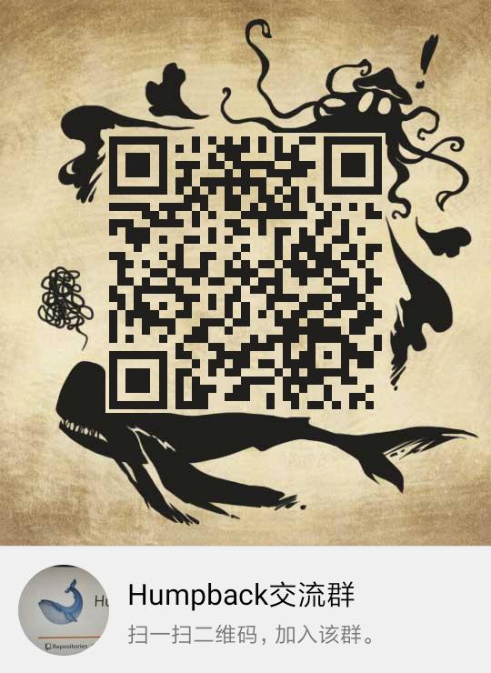
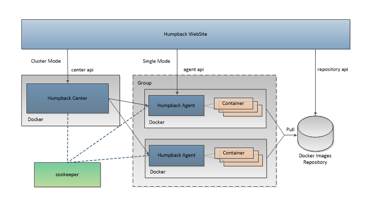

  

  Quickly build lightweight docker cloud for enterprise user.

## Home Page

* [https://github.com/golang-community/bluewhale](https://github.com/golang-community/bluewhale) 

## QQ Group

## Architecture

## Features

* Web UI supporting, easy to use.
* Container grouping and isolation.
* Container upgrades and cloning.
* Container monitoring.
* Container logs view.
* Private registry.

## Manage Mode

* `Single Mode`   
Single mode, which implements container management for a single group of hosts, providing container creation, container operations, container renaming, container upgrade and cloning, container monitoring, and container log output.

## Module

* [Bluewhale Web](https://github.com/golang-community/bluewhale-web)
* [Bluewhale Agent](https://github.com/golang-community/bluewhale-agent)

## Preview

Waiting...

## License

Bluewhale is licensed under the [Apache Licence 2.0](http://www.apache.org/licenses/LICENSE-2.0.html).   
